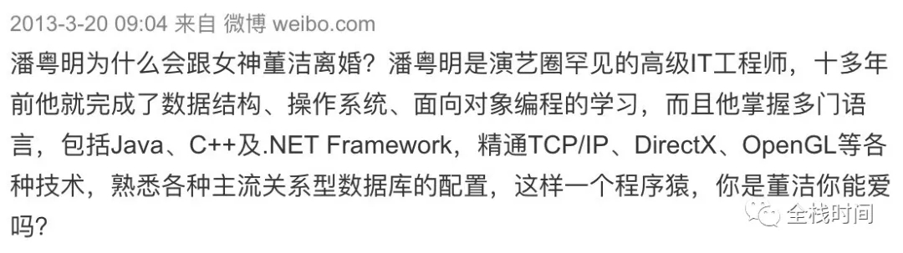

# 如何用 Docker 搭建 FIBOS 开发环境（一）

**作者：痛饮狂歌**

------

本文讲述如何用 Docker 搭建 [FIBOS](https://fibos.io/) 开发环境。

啥，FIBOS 是啥？大兄弟，别装了，你要没听说过 FIBOS，会来看我这篇文章？

好吧，我以非官方发言人的身份向你郑重宣布：FIBOS 是由有“ IT 圈潘粤明”之称的响马大叔~~站台（呸呸呸，谁站台，你才站台，你全家都站台）~~领导团队开发的……（此处省略500字），算了，还是直接拷贝官网说明吧：

> FIBOS 是一个结合 FIBJS 以及 EOS 的 JavaScript 的运行平台，它使得 EOS 提供可编程性，并允许使用 JavaScript 编写智能合约。

> FIBOS 平台的出现让第三代 EOS 智能合约编程变得简单、快捷!


话说，响马大叔的号召力那真不是盖的，短短一周时间，FIBOS 微信 01、02、03、04、05、06、07、08、09 ……班，二年级01、02、03……班，各城市分校群那是刷刷刷地建立起来了，一个字，那就是“火”，呃，还有一个字，那就是“惊”！


更拍案惊奇的还有这条微博，解了当年一桩公案：



这么火又惊的项目，咱肯定要学啊。好，现在开始进入正题，让我们看看如何用 Docker 搭建 FIBOS 开发环境，本文假定你已经安装好了 Docker，并对其有所了解。

#### 首先是获取合适的镜像，这里我们选择最新稳定版的 Ubuntu 镜像。

```
➜  ~ docker pull ubuntu:latest
```

下载完成：

```
latest: Pulling from library/ubuntu
c64513b74145: Pull complete
01b8b12bad90: Pull complete
c5d85cf7a05f: Pull complete
b6b268720157: Pull complete
e12192999ff1: Pull complete
Digest: sha256:3f119dc0737f57f704ebecac8a6d8477b0f6ca1ca0332c7ee1395ed2c6a82be7
Status: Downloaded newer image for ubuntu:latest
```

#### 在将镜像下载回本机后，我们就可以创建并运行基于该镜像的容器了，在下面的命令行中我们指定容器名为 fibos 以方便之后引用该容器。

```
➜  ~ docker run -it --name fibos ubuntu:latest
```

注意，我们现在已经处在容器终端命令行状态下：

```
root@b90ce45b3ff6:/#
```

输入以下命令更新容器系统并安装必要的工具和库：

```
root@b90ce45b3ff6:/# apt-get update \
&& apt-get install sudo curl vim libssl1.0.0 -y
```

安装完成：

```
.
.
.

Setting up curl (7.58.0-2ubuntu3.2) ...
Processing triggers for libc-bin (2.27-3ubuntu1) ...
Processing triggers for ca-certificates (20180409) ...
Updating certificates in /etc/ssl/certs...
0 added, 0 removed; done.
Running hooks in /etc/ca-certificates/update.d...
done.
```

#### 到这里，我们的准备工作就做完了，接下来就可照官网文档，安装 FIBOS 运行环境和运行示例啦。

```
root@b90ce45b3ff6:/# curl -s https://fibos.io/download/installer.sh | sh
  % Total    % Received % Xferd  Average Speed   Time    Time     Time  Current
                                 Dload  Upload   Total   Spent    Left  Speed
100 19.6M  100 19.6M    0     0   275k      0  0:01:13  0:01:13 --:--:--  341k
This program will install fibos into /usr/local/bin.
root@b90ce45b3ff6:/# fibos
Welcome to FIBOS. Based on fibjs 0.26.0-dev.
Type ".help" for more information.
> .info
{
  "fibjs": "0.26.0-dev",
  "git": "v0.25.0-58-g8aef38e",
  "clang": "4.0",
  "date": "Aug  6 2018 11:47:07",
  "vender": {
    "ev": "4.24",
    "expat": "2.2.5",
    "gd": "2.2.4",
    "jpeg": "8.3",
    "leveldb": "1.17",
    "mongo": "0.7",
    "pcre": "8.21",
    "png": "1.5.4",
    "mbedtls": "2.6.1",
    "snappy": "1.1.2",
    "sqlite": "3.23.0",
    "tiff": "3.9.5",
    "uuid": "1.6.2",
    "v8": "6.8.275.14",
    "v8-snapshot": true,
    "zlib": "1.2.7",
    "zmq": "3.1"
  }
}
```

在本系列的第二篇文章中，我们将讲讲如何重启、退出、进入容器，如何创建自己的 Docker 定制镜像，如何挂载数据卷和主机目录。