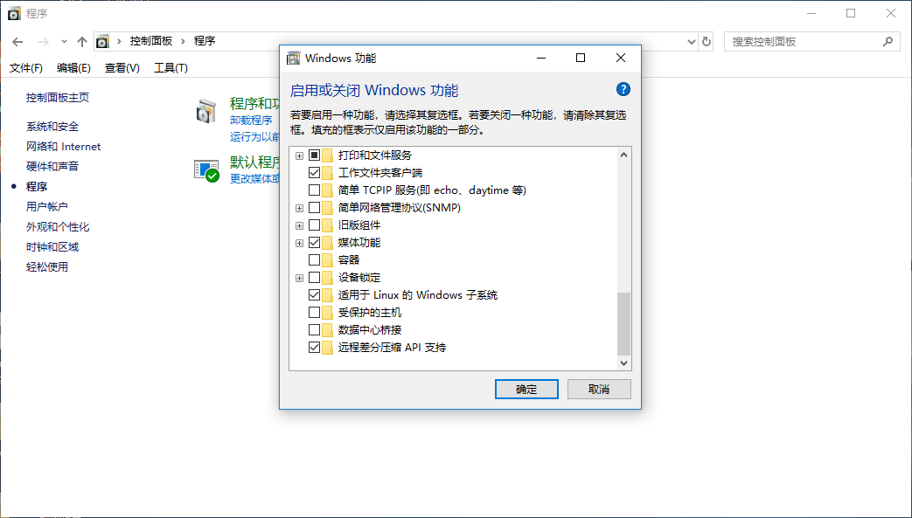
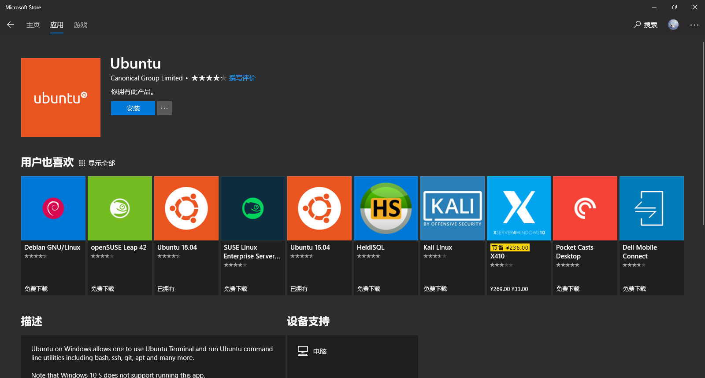
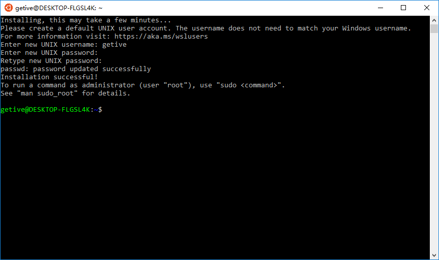

# 在 Windows 中玩转 FIBOS

**作者：痛饮狂歌**

------

FIBOS 并不直接支持在 Windows 系统上运行，但通过 WSL，我们可以先在 Windows 上安装自己喜爱的 Linux 发行版，然后在这个 Linux 系统中安装 FIBOS。

> 适用于 Linux 的 Windows 子系统（Windows Subsystem for Linux，简称 WSL）是一个为在 Windows 10 上能够原生运行 Linux 二进制可执行文件（ELF 格式）的兼容层。它是由微软与 Canonical 公司合作开发，目标是使纯正的 Ubuntu 14.04 / 18.04, OpenSUSE, Kali Linux 和 Debian 映像能下载和解压到用户的本地计算机，并且映像内的工具和实用工具能在此子系统上原生运行。

在启用 WSL 之前，请先确认你的 Window 系统是 64 位版的 Widnows 10，且操作系统版本不小于 16215（可通过「设置」 > 「系统」 > 「关于」来查看）。

在安装 Linux 发行版之前，先启用「适用于 Linux 的 Windows 子系统」可选功能：

* 方法一：以管理员身份打开 PowerShell 并运行：

```shell
Enable-WindowsOptionalFeature -Online -FeatureName Microsoft-Windows-Subsystem-Linux
```


* 方法二：在 控制面板 > 程序 > 启动或关闭 Windows 功能，选中「适用于 Linux 的 Windows 子系统」选项。



重启计算机后从 Windows 商店获取并安装想要的 Linux 发行版，比如 Ubuntu。



安装完成后启动 Ubuntu，等数分钟系统完成初始化后，按提示新建一个用户：



接下来，按照 FIBOS 官网文档安装 FIBOS:

```shell
getive@DESKTOP-FLGSL4K:~$ curl -s https://fibos.io/download/installer.sh | sh
  % Total    % Received % Xferd  Average Speed   Time    Time     Time  Current
                                 Dload  Upload   Total   Spent    Left  Speed
100 20.9M  100 20.9M    0     0  1663k      0  0:00:12  0:00:12 --:--:-- 1927k
This program will install fibos into /usr/local/bin.
[sudo] password for getive:
getive@DESKTOP-FLGSL4K:~$ fibos
Welcome to FIBOS. Based on fibjs 0.27.0-dev.
Type ".help" for more information.
> .info
{
  "fibjs": "0.27.0-dev",
  "git": "v0.26.0-9-ge84d08c",
  "gcc": "5.4.0",
  "date": "Sep  2 2018 02:50:09",
  "vender": {
    "ev": "4.24",
    "expat": "2.2.5",
    "gd": "2.2.4",
    "jpeg": "8.3",
    "leveldb": "1.17",
    "mongo": "0.7",
    "pcre": "8.21",
    "png": "1.5.4",
    "mbedtls": "2.6.1",
    "snappy": "1.1.2",
    "sqlite": "3.23.0",
    "tiff": "3.9.5",
    "uuid": "1.6.2",
    "v8": "6.8.275.14",
    "v8-snapshot": true,
    "zlib": "1.2.7",
    "zmq": "3.1"
  },
  "modules": [
    "softfloat",
    "fibos",
    "zmq",
    "zlib",
    "zip",
    "xml",
    "ws",
    "vm",
    "uuid",
    "util",
    "url",
    "tty",
    "timers",
    "test",
    "string_decoder",
    "tls",
    "ssl",
    "querystring",
    "punycode",
    "profiler",
    "process",
    "path",
    "os",
    "net",
    "mq",
    "json",
    "io",
    "iconv",
    "https",
    "http",
    "hex",
    "hash",
    "gd",
    "fs",
    "events",
    "encoding",
    "dns",
    "dgram",
    "db",
    "crypto",
    "coroutine",
    "buffer",
    "bson",
    "base64vlq",
    "base64",
    "base32",
    "assert"
  ]
}
> .exit
getive@DESKTOP-FLGSL4K:~$
```

在安装的 Linux 系统中，要想访问 Windows 中的目录及文件是非常方便的，因为 Linux 系统已经将 Windows 下的各驱动器自动挂接在 `/mnt` 目录下：

```shell
getive@DESKTOP-FLGSL4K:~$ cd /mnt
getive@DESKTOP-FLGSL4K:/mnt$ ls -l
total 0
drwxrwxrwx 1 getive getive 4096 Sep  5 07:12 c
drwxrwxrwx 1 getive getive  512 Sep  3 16:05 d
drwxrwxrwx 1 getive getive  512 Sep  3 16:05 e
drwxrwxrwx 1 getive getive 4096 Sep  4 17:11 f
getive@DESKTOP-FLGSL4K:/mnt$
```

这样，我们在 Windows 中用喜爱的可视化开发工具编写、修改 FIBOS 代码，在 Linux 系统中运行和调试代码就变得非常方便。

安装的 Linux 系统既可从开始菜单中启动，也可在 Windows 命令行中输入 Linux 系统的名字（比如 ubuntu）即可直接进入了该 Linux 系统了，如果需要，你可以同时开启多个 Linux 系统。

```
$ ubuntu

getive@DESKTOP-FLGSL4K:~$ pwd

/home/getive

getive@DESKTOP-FLGSL4K:~$ exit

logout

```

参考链接：

* [Windows Subsystem for Linux Documentation](https://docs.microsoft.com/en-us/windows/wsl/about)