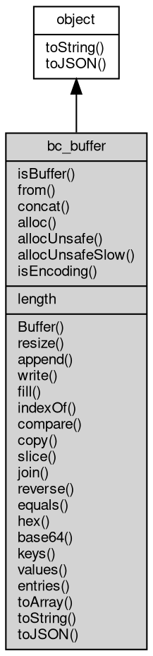

# 对象 bc_buffer
二进制数据缓存对象，用于 io 读写的数据处理

Buffer 对象为全局基础类，在任何时候都可以直接以 new Buffer(...) 创建：

```JavaScript
var buf = new Buffer();
```

## 继承关系


## 静态函数
        
### isBuffer
**检测给定的变量是否是 Buffer 对象**

```JavaScript
static Boolean Buffer.isBuffer(Value v);
```

调用参数:
* v: Value, 给定需要检测的变量

返回结果:
* Boolean, 传入对象是否 Buffer 对象

实例:

```JavaScript
exports.hi = v => {
    var buf = new Buffer("abcd");
    var str = "abcd"
    console.log(Buffer.isBuffer(buf));
    console.log(Buffer.isBuffer(str));
}
```

--------------------------
### from
**通过其他 Buffer 创建 Buffer 对象**

```JavaScript
static Buffer Buffer.from(Buffer buffer,
    Integer byteOffset = 0,
    Integer length = -1);
```

调用参数:
* buffer: Buffer, 给定 Buffer 类型变量用于创建 Buffer 对象
* byteOffset: Integer, 指定数据起始位置，起始为 0
* length: Integer, 指定数据长度，起始位 -1，表示剩余所有数据

返回结果:
* Buffer, 返回 Buffer 实例

实例:

```JavaScript
exports.hi = v => {
    var buf = Buffer.from(new Buffer("abcd"), 1, 2);
    console.log(buf.toString());
}
```

--------------------------
**通过字符串创建 Buffer 对象**

```JavaScript
static Buffer Buffer.from(String str,
    Integer byteOffset = 0,
    Integer length = -1);
```

调用参数:
* str: String, 初始化字符串，字符串将以 utf-8 格式写入
* byteOffset: Integer, 指定数据起始位置，起始为 0
* length: Integer, 指定数据长度，起始位 -1，表示剩余所有数据

返回结果:
* Buffer, 返回 Buffer 实例

实例:

```JavaScript
exports.hi = v => {
    var buf = Buffer.from("abcd", 0, 2);
    console.log(buf.toString());
}
```

--------------------------
**通过字符串创建 Buffer 对象**

```JavaScript
static Buffer Buffer.from(String str,
    String codec = "utf8");
```

调用参数:
* str: String, 初始化字符串，字符串将以 utf-8 格式写入，缺省则创建一个空对象
* codec: String, 指定编码格式，允许值为："hex", "base64", "utf8", 或者系统支持的字符集

返回结果:
* Buffer, 返回 Buffer 实例

实例:

```JavaScript
exports.hi = v => {
    var buf = new Buffer("厉害！", "utf8");
    console.log(buf.toString());
}
```

--------------------------
### concat
**拼接多个缓存区中的数据**

```JavaScript
static Buffer Buffer.concat(Array buflist,
    Integer cutLength = -1);
```

调用参数:
* buflist: Array, 待拼接的Buffer数组
* cutLength: Integer, 截取多少个Buffer对象

返回结果:
* Buffer, 拼接后产生的新 Buffer 对象

实例:

```JavaScript
exports.hi = v => {
    var buf1 = new Buffer("abcd");
    var buf2 = new Buffer("efg");
    var buf3 = new Buffer();
    var bufArray = [buf1];
    var bufRes = Buffer.concat(bufArray);
    console.log(bufRes.toString());

    bufArray = [buf1, buf2];
    bufRes = Buffer.concat(bufArray);
    console.log(bufRes.toString());

    bufRes = Buffer.concat(bufArray, 6);
    console.log(bufRes.toString());

    buf1 = new Buffer([0x31, 0x32, 0x33, 0x34]);
    buf2 = new Buffer([0x35, 0x36, 0x37, 0x38]);
    bufArray = [buf1, buf2];
    bufRes = Buffer.concat(bufArray);
    console.log(bufRes.toString());

    var buf2 = Buffer.concat([]);
    console.log(buf2.length);
}
```

--------------------------
### alloc
**分配一个指定长度的新缓存区。如果大小为0，将创建一个零长度的缓存区。**

```JavaScript
static Buffer Buffer.alloc(Integer size,
    Integer fill = 0,
    String codec = "utf8");
```

调用参数:
* size: Integer, 缓冲区的所需长度
* fill: Integer, 预先填充新缓冲区的值，可使用 string/buffer/integer 值类型。 默认值：0
* codec: String, 指定编码格式，允许值为："hex", "base64", "utf8", 或者系统支持的字符集

返回结果:
* Buffer, 填充好的新 Buffer 对象

实例:

```JavaScript
exports.hi = v => {
    var buf1 = Buffer.alloc(10, 0, "utf8");
    console.log(buf1.toString());
}
```

--------------------------
**分配一个指定长度的新缓存区。如果大小为0，将创建一个零长度的缓存区。**

```JavaScript
static Buffer Buffer.alloc(Integer size,
    String fill = "",
    String codec = "utf8");
```

调用参数:
* size: Integer, 缓冲区的所需长度
* fill: String, 预先填充新缓冲区的值，可使用 string/buffer/integer 值类型。 默认值：0
* codec: String, 指定编码格式，允许值为："hex", "base64", "utf8", 或者系统支持的字符集

返回结果:
* Buffer, 填充好的新 Buffer 对象

实例:

```JavaScript
exports.hi = v => {
    var buf1 = Buffer.alloc(11, 'aGVsbG8gd29ybGQ=', 'base64');
    var buf2 = Buffer.alloc(16, 'aGVsbG8gd29ybGQ=', 'base64');
    console.log(buf1.toString());
    console.log(buf2.toString());
}
```

--------------------------
**分配一个指定长度的新缓存区。如果大小为0，将创建一个零长度的缓存区。**

```JavaScript
static Buffer Buffer.alloc(Integer size,
    Buffer fill,
    String codec = "utf8");
```

调用参数:
* size: Integer, 缓冲区的所需长度
* fill: Buffer, 预先填充新缓冲区的值，可使用 string/buffer/integer 值类型。 默认值：0
* codec: String, 指定编码格式，允许值为："hex", "base64", "utf8", 或者系统支持的字符集

返回结果:
* Buffer, 填充好的新 Buffer 对象

实例:

```JavaScript
exports.hi = v => {
    var buf1 = Buffer.alloc(11, new Buffer('aGVsbG8gd29ybGQ='), 'base64');
    var buf2 = Buffer.alloc(16, new Buffer('aGVsbG8gd29ybGQ='), 'base64');
    console.log(buf1.toString());
    console.log(buf2.toString());
}
```

--------------------------
### allocUnsafe
**分配一个指定长度的新缓存区。如果大小为0，将创建一个零长度的缓存区。**

```JavaScript
static Buffer Buffer.allocUnsafe(Integer size);
```

调用参数:
* size: Integer, 缓冲区的所需长度

返回结果:
* Buffer, 指定尺寸的新 Buffer 对象

实例:

```JavaScript
exports.hi = v => {
    var buf1 = Buffer.allocUnsafe(10);
    console.log(buf1.length);
}
```

--------------------------
### allocUnsafeSlow
**分配一个指定长度的新缓存区。如果大小为0，将创建一个零长度的缓存区。**

```JavaScript
static Buffer Buffer.allocUnsafeSlow(Integer size);
```

调用参数:
* size: Integer, 缓冲区的所需长度

返回结果:
* Buffer, 指定尺寸的新 Buffer 对象

实例:

```JavaScript
exports.hi = v => {
    var buf1 = Buffer.allocUnsafeSlow(10);
    console.log(buf1.length);
}
```

--------------------------
### isEncoding
**检测编码格式是否被支持**

```JavaScript
static Boolean Buffer.isEncoding(String codec);
```

调用参数:
* codec: String, 待检测的编码格式

返回结果:
* Boolean, 是否支持

实例:

```JavaScript
exports.hi = v => {
    console.log(Buffer.isEncoding('utf8')); // true
    console.log(Buffer.isEncoding('utf-8')); // true
    console.log(Buffer.isEncoding('gbk')); // false
    console.log(Buffer.isEncoding('gb2312')); // false
    console.log(Buffer.isEncoding('hex')); // true
    console.log(Buffer.isEncoding('base64')); // true
    console.log(Buffer.isEncoding('jis')); // false
    console.log(Buffer.isEncoding('aaabbbccc')); // false
    console.log(Buffer.isEncoding('binary')); // false
    console.log(Buffer.isEncoding('latin1')); // false
    console.log(Buffer.isEncoding('big5')); // false
}
```

## 成员属性
        
### length
**Integer, 获取缓存对象的尺寸**

```JavaScript
readonly Integer Buffer.length;
```

## 成员函数
        
### Buffer
**缓存对象构造函数**

```JavaScript
Buffer.Buffer(Array datas);
```

调用参数:
* datas: Array, 初始化数据数组

```JavaScript
exports.hi = v => {
    var buf = new Buffer([0x31, 0x32, 0x33, 0x34])
    console.log(buf.toString());
}
```

--------------------------
**缓存对象构造函数**

```JavaScript
Buffer.Buffer(ArrayBuffer datas);
```

调用参数:
* datas: ArrayBuffer, 初始化数据数组

```JavaScript
exports.hi = v => {
    var arr = new Uint16Array(2);
    arr[0] = 5000;
    arr[1] = 4000;
    var buf = new Buffer(arr.buffer);
    console.log(buf.hex());
}
```

--------------------------
**缓存对象构造函数**

```JavaScript
Buffer.Buffer(TypedArray datas);
```

调用参数:
* datas: TypedArray, 初始化数据数组

```JavaScript
exports.hi = v => {
    var arr = new Uint8Array(2);
    arr[0] = 50;
    arr[1] = 40;
    var buf = new Buffer(arr);
    console.log(buf.hex());

    var arr = new Uint16Array(2);
    arr[0] = 5000;
    arr[1] = 4000;
    var buf = new Buffer(arr);
    console.log(buf.hex());

    var arr = new Uint8Array([0x10, 0x20, 0x30]);
    var arr1 = new Uint8Array(arr.buffer, 1, 2);
    var buf = new Buffer(arr1);
    console.log(buf.hex());
}
```

--------------------------
**缓存对象构造函数**

```JavaScript
Buffer.Buffer(ArrayBufferView datas);
```

调用参数:
* datas: ArrayBufferView, 初始化数据数组

```JavaScript
exports.hi = v => {
    var arr = new DataView(new ArrayBuffer(2));
    arr.setInt8(0, 0x10);
    arr.setInt8(1, 0x20);
    var buf = new Buffer(arr);
    console.log(buf.hex());
}
```

--------------------------
**缓存对象构造函数**

```JavaScript
Buffer.Buffer(Buffer buffer);
```

调用参数:
* buffer: Buffer, 初始化Buffer对象

```JavaScript
exports.hi = v => {
    var buf = new Buffer(new Buffer("abcd"));
    console.log(buf.toString());
}
```

--------------------------
**缓存对象构造函数**

```JavaScript
Buffer.Buffer(String str,
    String codec = "utf8");
```

调用参数:
* str: String, 初始化字符串，字符串将以 utf-8 格式写入，缺省则创建一个空对象
* codec: String, 指定编码格式，允许值为："hex", "base64", "utf8", 或者系统支持的字符集

```JavaScript
exports.hi = v => {
    var buf = new Buffer("abcd", "utf8");
    console.log(buf.toString());
}
```

--------------------------
**缓存对象构造函数**

```JavaScript
Buffer.Buffer(Integer size = 0);
```

调用参数:
* size: Integer, 初始化缓冲区大小

实例:

```JavaScript
exports.hi = v => {
    var buf = new Buffer(100);
    console.log(buf.length);
}
```

--------------------------
### resize
**修改缓存对象尺寸**

```JavaScript
Buffer.resize(Integer sz);
```

调用参数:
* sz: Integer, 指定新尺寸

实例:

```JavaScript
exports.hi = v => {
    var buf = new Buffer("abcded");
    buf.resize(10);
    console.log(buf);
}
```

--------------------------
### append
**在缓存对象尾部写入一组二进制数据**

```JavaScript
Buffer.append(Buffer data);
```

调用参数:
* data: Buffer, 初始化二进制数据

实例:

```JavaScript
exports.hi = v => {
    var buf = new Buffer([0x31, 0x32, 0x33, 0x34]);
    buf.append("abcd");
    buf.append([0x31, 0x32, 0x33, 0x34]);
    console.log(buf.toString());
}
```

--------------------------
**在缓存对象尾部写入字符串，字符串将以 utf-8 格式写入**

```JavaScript
Buffer.append(String str,
    String codec = "utf8");
```

调用参数:
* str: String, 要写入的字符串
* codec: String, 指定编码格式，允许值为："hex", "base64", "utf8", 或者系统支持的字符集

实例:

```JavaScript
exports.hi = v => {
    var buf = new Buffer([0x31, 0x32, 0x33, 0x34]);
    buf.append("3132", "hex");
    buf.append("MTIzNA==", "base64");
    console.log(buf.toString());
}
```

--------------------------
### write
**向缓存对象写入指定字符串，字符串默认为utf-8，越界时只写入部分数据**

```JavaScript
Integer Buffer.write(String str,
    Integer offset = 0,
    Integer length = -1,
    String codec = "utf8");
```

调用参数:
* str: String, 待写入的字符串
* offset: Integer, 写入起始位置
* length: Integer, 写入长度（单位字节，默认值-1），未指定时为待写入字符串的长度
* codec: String, 指定编码格式，允许值为："hex", "base64", "utf8", 或者系统支持的字符集

返回结果:
* Integer, 写入的数据字节长度

实例:

```JavaScript
exports.hi = v => {
    var buf = new Buffer(10);
    buf.write("abcd", 0, 4, 'utf8')
    console.log(buf.toString('utf8', 0, 4));
}
```

--------------------------
**向缓存对象写入指定字符串，字符串默认为utf-8，越界时只写入部分数据**

```JavaScript
Integer Buffer.write(String str,
    Integer offset = 0,
    String codec = "utf8");
```

调用参数:
* str: String, 待写入的字符串
* offset: Integer, 写入起始位置
* codec: String, 指定编码格式，允许值为："hex", "base64", "utf8", 或者系统支持的字符集

返回结果:
* Integer, 写入的数据字节长度

实例:

```JavaScript
exports.hi = v => {
    buf = new Buffer(10);
    buf.write("MTIzNA==", 0, "base64");
    console.log(buf.toString("utf8", 0, 4));
}
```

--------------------------
**向缓存对象写入指定字符串，字符串默认为utf-8，越界时只写入部分数据**

```JavaScript
Integer Buffer.write(String str,
    String codec = "utf8");
```

调用参数:
* str: String, 待写入的字符串
* codec: String, 指定编码格式，允许值为："hex", "base64", "utf8", 或者系统支持的字符集

返回结果:
* Integer, 写入的数据字节长度

实例:

```JavaScript
exports.hi = v => {
    buf = new Buffer(10);
    buf.write("MTIzNA==", "base64");
    console.log(buf.toString("utf8"));
}
```

--------------------------
### fill
**为 Buffer 对象填充指定内容数据**

```JavaScript
Buffer Buffer.fill(Integer v,
    Integer offset = 0,
    Integer end = -1);
```

调用参数:
* v: Integer, 需要填充的数据，如果未指定 offset 和 end，将填充满整个 buffer
* offset: Integer, 填充起始位置
* end: Integer, 填充终止位置

返回结果:
* Buffer, 返回当前 Buffer 对象

实例:

```JavaScript
exports.hi = v => {
    var buf = new Buffer(10);
    buf.fill(1);
    console.log(buf.toString());
}
```

--------------------------
**为 Buffer 对象填充指定内容数据**

```JavaScript
Buffer Buffer.fill(Buffer v,
    Integer offset = 0,
    Integer end = -1);
```

调用参数:
* v: Buffer, 需要填充的数据，如果未指定 offset 和 end，将填充满整个 buffer
* offset: Integer, 填充起始位置
* end: Integer, 填充终止位置

返回结果:
* Buffer, 返回当前 Buffer 对象

实例:

```JavaScript
exports.hi = v => {
    var buf = new Buffer(10);
    buf.fill(new Buffer("abc"));
    console.log(buf.toString());
}
```

--------------------------
**为 Buffer 对象填充指定内容数据**

```JavaScript
Buffer Buffer.fill(String v,
    Integer offset = 0,
    Integer end = -1);
```

调用参数:
* v: String, 需要填充的数据，如果未指定 offset 和 end，将填充满整个 buffer
* offset: Integer, 填充起始位置
* end: Integer, 填充终止位置

返回结果:
* Buffer, 返回当前 Buffer 对象

实例:

```JavaScript
exports.hi = v => {
    var buf = new Buffer(10);
    buf.fill("abc");
    console.log(buf.toString());
}
```

--------------------------
### indexOf
**返回某个指定数据在 Buffer 中首次出现的位置**

```JavaScript
Integer Buffer.indexOf(Integer v,
    Integer offset = 0);
```

调用参数:
* v: Integer, 待查找数据，如果未指定 offset，默认从起始位开始
* offset: Integer, 起始查找位置

返回结果:
* Integer, 返回查找到的位置，未找到返回 -1

实例:

```JavaScript
exports.hi = v => {
    var buf = new Buffer([0x31, 0x32, 0x33, 0x34, 0x00]);
    console.log(buf.indexOf(0x33));
    console.log(buf.indexOf(0x00));
}
```

--------------------------
**返回某个指定数据在 Buffer 中首次出现的位置**

```JavaScript
Integer Buffer.indexOf(String v,
    Integer offset = 0);
```

调用参数:
* v: String, 待查找数据，如果未指定 offset，默认从起始位开始
* offset: Integer, 起始查找位置

返回结果:
* Integer, 返回查找到的位置，未找到返回 -1

实例:

```JavaScript
exports.hi = v => {
    var buf = new Buffer("cacdbfcde");
    console.log(buf.indexOf("cd", 1));

}
```

--------------------------
### compare
**比较缓存区的内容**

```JavaScript
Integer Buffer.compare(Buffer buf);
```

调用参数:
* buf: Buffer, 待比较缓存对象

返回结果:
* Integer, 内容比较结果

实例:

```JavaScript
exports.hi = v => {
    var buf = new Buffer("abcd");
    console.log(buf.compare(new Buffer("abcd")));
    console.log(buf.compare(new Buffer("abc")));
    console.log(buf.compare(new Buffer("abcde")));
}
```

--------------------------
### copy
**从源缓存对象区域拷贝数据到目标缓存对象区域**

```JavaScript
Integer Buffer.copy(Buffer targetBuffer,
    Integer targetStart = 0,
    Integer sourceStart = 0,
    Integer sourceEnd = -1);
```

调用参数:
* targetBuffer: Buffer, 目标缓存对象
* targetStart: Integer, 目标缓存对象开始拷贝字节位置，缺省为 0
* sourceStart: Integer, 源缓存对象开始字节位置, 缺省为 0
* sourceEnd: Integer, 源缓存对象结束字节位置, 缺省为 -1,表示源数据长度

返回结果:
* Integer, 拷贝的数据字节长度

实例:

```JavaScript
exports.hi = v => {
    var buf1 = new Buffer([0x31, 0x32, 0x33]);
    var arr = [0x34, 0x35, 0x36];

    var buf2 = new Buffer(arr);
    var sz = buf1.copy(buf2);
    console.log(sz);
    console.log(buf2.toString());
}
```

--------------------------
### slice
**返回一个新缓存对象，包含指定起始到缓存结尾的数据**

```JavaScript
Buffer Buffer.slice(Integer start = 0);
```

调用参数:
* start: Integer, 指定范围的起始，缺省从头开始

返回结果:
* Buffer, 返回新的缓存对象

实例:

```JavaScript
exports.hi = v => {
    var buf = new Buffer(10);
    buf.write("abcdefghih");
    console.log(buf.slice(8).toString());
}
```

--------------------------
**返回一个新缓存对象，包含指定范围的数据，若范围超出缓存，则只返回有效部分数据**

```JavaScript
Buffer Buffer.slice(Integer start,
    Integer end);
```

调用参数:
* start: Integer, 指定范围的起始
* end: Integer, 指定范围的结束

返回结果:
* Buffer, 返回新的缓存对象

实例:

```JavaScript
exports.hi = v => {
    var buf = new Buffer(10);
    buf.write("abcdefghih");
    console.log(buf.slice(0, 3).toString());
    console.log(buf.slice(0, 11).toString());
}
```

--------------------------
### join
**把当前对象中的所有元素放入一个字符串**

```JavaScript
String Buffer.join(String separator = ",");
```

调用参数:
* separator: String, 分割字符，缺省为 ","

返回结果:
* String, 返回生成的字符串

实例:

```JavaScript
exports.hi = v => {
    var a = new Buffer([192, 168, 0, 1]);
    console.log(a.join('.'));
}
```

--------------------------
### reverse
**返回一个新缓存对象，包含当前对象数据的倒序**

```JavaScript
Buffer Buffer.reverse();
```

返回结果:
* Buffer, 返回新的缓存对象

实例:

```JavaScript
exports.hi = v => {
    var a = new Buffer("abcd");
    console.log(a.reverse().toString());
}
```

--------------------------
### equals
**比较当前对象与给定的对象是否相等**

```JavaScript
Boolean Buffer.equals(object expected);
```

调用参数:
* expected: object, 制定比较的目标对象

返回结果:
* Boolean, 返回对象比较的结果

实例:

```JavaScript
exports.hi = v => {
    var buf = new Buffer("abcd");
    console.log(buf.equals(new Buffer("abcd")));
    console.log(buf.equals(new Buffer("abc")));
}
```

--------------------------
### hex
**使用 16 进制编码缓存对象内容**

```JavaScript
String Buffer.hex();
```

返回结果:
* String, 返回编码字符串

--------------------------
### base64
**使用 base64 编码缓存对象内容**

```JavaScript
String Buffer.base64();
```

返回结果:
* String, 返回编码字符串

--------------------------
### keys
**返回全部二进制数据的数组**

```JavaScript
Iterator Buffer.keys();
```

返回结果:
* Iterator, 返回包含对象数据索引的迭代器

--------------------------
### values
**返回全部二进制数据的数组**

```JavaScript
Iterator Buffer.values();
```

返回结果:
* Iterator, 返回包含对象数据值的迭代器

--------------------------
### entries
**返回包含对象数据 [index, byte] 对的迭代器**

```JavaScript
Iterator Buffer.entries();
```

返回结果:
* Iterator, [index, byte] 对的迭代器

--------------------------
### toArray
**返回全部二进制数据的数组**

```JavaScript
Array Buffer.toArray();
```

返回结果:
* Array, 返回包含对象数据的数组

实例:

```JavaScript
exports.hi = v => {
    var buf = new Buffer("buffer");
    console.log(buf.toArray());
}
```

--------------------------
### toString
**返回二进制数据的编码字符串**

```JavaScript
String Buffer.toString(String codec,
    Integer offset = 0,
    Integer end);
```

调用参数:
* codec: String, 指定编码格式，允许值为："hex", "base64", "utf8", 或者系统支持的字符集
* offset: Integer, 读取起始位置
* end: Integer, 读取终止位置

返回结果:
* String, 返回对象的字符串表示

实例:

```JavaScript
exports.hi = v => {
    var buf = new Buffer([0x31, 0x32, 0x33, 0x34]);
    console.log(buf.toString("utf8", 1, 3));
}
```

--------------------------
**返回二进制数据的编码字符串**

```JavaScript
String Buffer.toString(String codec,
    Integer offset = 0);
```

调用参数:
* codec: String, 指定编码格式，允许值为："hex", "base64", "utf8", 或者系统支持的字符集
* offset: Integer, 读取起始位置

返回结果:
* String, 返回对象的字符串表示

实例:

```JavaScript
exports.hi = v => {
    var buf = new Buffer([0x31, 0x32, 0x33, 0x34]);
    console.log(buf.toString("utf8", 1));
    console.log(buf.toString("hex", 2));
    console.log(buf.toString("base64", 2));
}
```

--------------------------
**返回二进制数据的 utf8 编码字符串**

```JavaScript
String Buffer.toString();
```

返回结果:
* String, 返回对象的字符串表示

实例:

```JavaScript
exports.hi = v => {
    var buf = new Buffer([0x31, 0x32, 0x33, 0x34]);
    console.log(buf.toString());
}
```

--------------------------
### toJSON
**返回对象的 JSON 格式表示，一般返回对象定义的可读属性集合**

```JavaScript
String Buffer.toJSON();
```

返回结果:
* String, 返回对象的 JSON 格式表示

实例:

```JavaScript
exports.hi = v => {
    var buf = new Buffer("buffer");
    console.log(buf.toJSON());
}
```
