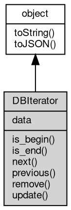

# DBIterator 对象


## 成员属性

### data
**Object, 查询当前数据，返回所有数据对象，每个数据是一个新的 DBIterator 对象**

```JavaScript
readonly Object DBIterator.data;
```

## 成员函数

### is_begin
**判断数据是否为首数据**

```JavaScript
Boolean DBIterator.is_begin();
```

实例:

```JavaScript
exports.hi1 = v => {
    var players = db.players(action.account, action.account);
    var itr = players.find(v);
    console.log(itr.is_begin());
}；
```

--------------------------
### is_end
**判断数据是否为尾数据**

```JavaScript
Boolean DBIterator.is_end();
```

实例:

```JavaScript
exports.hi1 = v => {
    var players = db.players(action.account, action.account);
    var itr = players.find(v);
    console.log(itr.is_end());
}；
```

--------------------------
### next
**获取下一个数据**

```JavaScript
DBIterator DBIterator.next();
```

实例:

```JavaScript
exports.hi1 = v => {
    var players = db.players(action.account, action.account);
    var itr = players.find(v);
    var itr1 = itr.next();
    console.log(itr1.toJSON());
}；
```

--------------------------
### previous
**获取上一个数据**

```JavaScript
DBIterator DBIterator.previous();
```

实例:

```JavaScript
exports.hi1 = v => {
    var players = db.players(action.account, action.account);
    var itr = players.find(v);
    var itr1 = itr.next();
    var itr2 = itr1.previous();
    console.log(itr2.toJSON());
}；
```

--------------------------
### remove
**删除数据**

```JavaScript
DBIterator.remove();
```

实例:

```JavaScript
exports.hi1 = v => {
    var players = db.players(action.account, action.account);
    var itr = players.find(v);
    itr.remove();
}；
```

--------------------------
### update
**更新数据**

```JavaScript
DBIterator.update(String payer);
```

调用参数:
* payer: String, 为此次操作付费的账户

实例:

```JavaScript
exports.hi1 = v => {
    var players = db.players(action.account, action.account);
    var itr = players.find(v);
    itr.data.age = 18;
    itr.update(action.account);
}；
```

--------------------------
### toString
**返回对象的字符串表示，一般返回 "[Native Object]"，对象可以根据自己的特性重新实现**

```JavaScript
String DBIterator.toString();
```

返回结果:
* String, 返回对象的字符串表示

--------------------------
### toJSON
**返回对象的 JSON 格式表示，一般返回对象定义的可读属性集合**

```JavaScript
Value DBIterator.toJSON(String key = "");
```

调用参数:
* key: String, 未使用

返回结果:
* Value, 返回包含可 JSON 序列化的值


