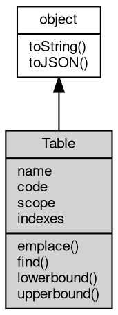

# Table 对象
multi index table 对象

## 继承关系


## 成员属性

### name
**String, table 名**

```JavaScript
readonly String Table.name;
```

--------------------------
### code
**String, 指向合约发布者的名称**

```JavaScript
readonly String Table.code;
```

--------------------------
### scope
**String, table 中数据所属的 account_name**

```JavaScript
readonly String Table.scope;
```

--------------------------
### indexes
**Object, 查询当前索引，返回所有索引对象，每个索引是一个新的 Table 对象**

```JavaScript
readonly Object Table.indexes;
```

## 成员函数

### emplace
**向 table 存入新数据**

```JavaScript
Table.emplace(String payer,
    Object val);
```

调用参数:
* payer: String, 为此次操作付费的账户
* val: Object, 将要存入到 table 的值

实例：

```JavaScript
const indexes = {
    detail: [128, o => [o.age,o.nickname]]
};
exports.hi = v => {
    var players = db.players(action.account, action.account,indexes);
    players.emplace(action.account, {
        title: "ceo",
        age: 48,
        nickname: "lion1",
        id: 123
    });
};
```

--------------------------
### find
**从 table 查找数据**

```JavaScript
DBIterator Table.find(Value id);
```

调用参数:
* id: Value, 查询的参数

实例:

```JavaScript
const indexes = {
    detail: [128, o => [o.age,o.weight]]
};
exports.hi = v => {
    var players = db.players(action.account, action.account,indexes);
    console.log(players.indexes.detail.find({age:48,nickname:"lion1"}))
};
```

--------------------------
### lowerbound
**从 table 查找小于参数结果**

```JavaScript
DBIterator Table.lowerbound(Value id);
```

调用参数:
* id: Value, 查询的参数

实例:

```JavaScript
exports.hi1 = v => {
    var players = db.players1(action.account, action.account);
    var data = players.lowerbound(123);
    console.log(data.data, data1.data);
};
```

--------------------------
### upperbound
**从 table 查找大于参数结果**

```JavaScript
DBIterator Table.upperbound(Value id);
```

调用参数:
* id: Value, 查询的参数

实例:

```JavaScript
exports.hi1 = v => {
    var players = db.players1(action.account, action.account);
    var data1 = players.upperbound(123);
    console.log(data.data, data1.data);
};
```

--------------------------
### toString
**返回对象的字符串表示，一般返回 "[Native Object]"，对象可以根据自己的特性重新实现**

```JavaScript
String Table.toString();
```

返回结果:
* String, 返回对象的字符串表示

--------------------------
### toJSON
**返回对象的 JSON 格式表示，一般返回对象定义的可读属性集合**

```JavaScript
Value Table.toJSON(String key = "");
```

调用参数:
* key: String, 未使用

返回结果:
* Value, 返回包含可 JSON 序列化的值

