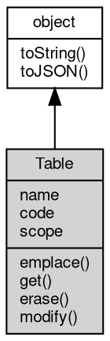

# 对象 Table

## 继承关系


## 成员属性
        
### name
****

```JavaScript
readonly String Table.name;
```

--------------------------
### code
****

```JavaScript
readonly String Table.code;
```

--------------------------
### scope
****

```JavaScript
readonly String Table.scope;
```

## 成员函数
        
### emplace
****

```JavaScript
Table.emplace(String payer,
    Object val);
```

调用参数:

--------------------------
### get
****

```JavaScript
Value Table.get(Value id);
```

调用参数:

--------------------------
### erase
****

```JavaScript
Table.erase(Value id);
```

调用参数:

--------------------------
### modify
****

```JavaScript
Table.modify(Value id,
    String payer,
    Object val);
```

调用参数:

--------------------------
### toString
**返回对象的字符串表示，一般返回 "[Native Object]"，对象可以根据自己的特性重新实现**

```JavaScript
String Table.toString();
```

返回结果:
* String, 返回对象的字符串表示

--------------------------
### toJSON
**返回对象的 JSON 格式表示，一般返回对象定义的可读属性集合**

```JavaScript
Value Table.toJSON(String key = "");
```

调用参数:
* key: String, 未使用

返回结果:
* Value, 返回包含可 JSON 序列化的值

